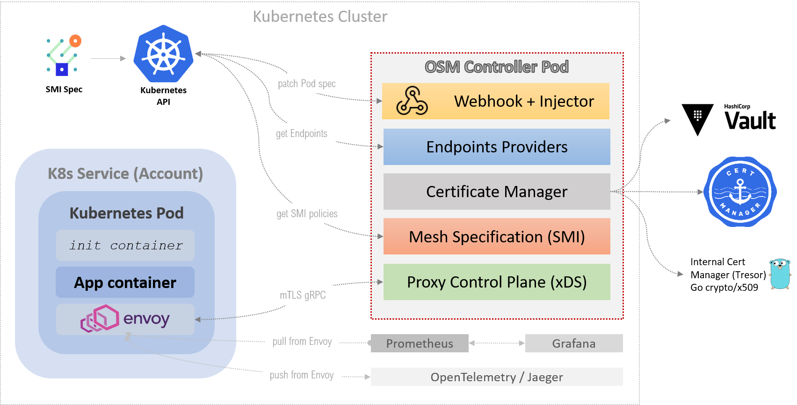

# Open Service Mesh Design

## Document Purpose

This document is the detailed design and architecture of the Open Service Mesh being built in this repository.


## Overview

Open Service Mesh (OSM) is a simple, complete, and standalone [service mesh](https://en.wikipedia.org/wiki/Service_mesh) solution.
OSM provides a fully featured control plane. It leverages an architecture based on [Envoy](https://www.envoyproxy.io/) reverse-proxy sidecar.
While by default OSM ships with Envoy, the design utilizes [interfaces](#interfaces), which enable integrations with any xDS compatible reverse-proxy.
OSM relies on [SMI Spec](https://smi-spec.io/) to reference services that will participate in the service mesh.
OSM ships out-of-the-box with all necessary components to deploy a complete service mesh spanning multiple compute platforms.


## Use Case

*As on operator of services spanning diverse compute platforms (Kubernetes and Virtual Machines on public and private clouds) I need an open-source solution, which will dynamically*:
  - **Apply policies** governing TCP & HTTP access between peer services
  - **Encrypt traffic** between services leveraging mTLS and short-lived certificates with a custom CA
  - **Rotate certificates** as often as necessary to make these short-lived and remove the need for certificate revocation management
  - **Collect traces and metrics** to provide visibility into the health and operation of the services
  - **Implement traffic split** between various versions of the services deployed as defined via [SMI Spec](https://smi-spec.io/)


*The system must be:*
  - easy to understand
  - simple to install
  - effortless to maintain
  - painless to troubleshoot
  - configurable via [SMI Spec](https://smi-spec.io/)


## OSM Components & Interactions


### Containers
When a new Pod creation is initiated, OSM's
[MutatingWebhookConfiguration](https://github.com/openservicemesh/osm/blob/release-v0.3/charts/osm/templates/mutatingwebhook.yaml)
intercepts the
[create](https://github.com/openservicemesh/osm/blob/release-v0.3/pkg/injector/webhook.go#L295)
[pod](https://github.com/openservicemesh/osm/blob/release-v0.3/pkg/injector/webhook.go#L299)
operations for [namespaces joined to the mesh](https://github.com/openservicemesh/osm/blob/release-v0.3/charts/osm/templates/mutatingwebhook.yaml#L19),
and forwards these API calls to the
[OSM control plane](https://github.com/openservicemesh/osm/blob/release-v0.3/charts/osm/templates/mutatingwebhook.yaml#L11).
OSM control plane augments ([patches](https://github.com/openservicemesh/osm/blob/release-v0.3/pkg/injector/webhook.go#L202-L208))
the Pod spec with 2 new containers.
One is the [Envoy sidecar](https://github.com/openservicemesh/osm/blob/release-v0.3/pkg/injector/patch.go#L82-L86),
the other is an [init container](https://github.com/openservicemesh/osm/blob/release-v0.3/pkg/injector/patch.go#L61-L74).
The init container is ephemeral. It executes the [init-iptables.sh bash script](https://github.com/openservicemesh/osm/blob/release-v0.3/init-iptables.sh)
and terminates.
The init container requires [NET_ADMIN Kernel capability](https://github.com/openservicemesh/osm/blob/release-v0.3/pkg/injector/init-container.go#L21-L25) for
[iptables](https://en.wikipedia.org/wiki/Iptables) changes to be applied.
OSM uses `iptables` to ensure that all inbound and outbound traffic flows through the Envoy sidecar.
The [init container Docker image](https://hub.docker.com/r/openservicemesh/init)
is passed as a string pointing to a container registry. This is passed via the `--init-container-image` CLI param to the OSM controller on startup. The default value is defined in the [OSM Deployment chart](https://github.com/openservicemesh/osm/blob/release-v0.3/charts/osm/templates/osm-deployment.yaml#L33).

## High-level software architecture

The Open Service Mesh project is composed of the following five high-level components:
  1. [Proxy control plane](#1-proxy-control-plane) - handles gRPC connections from the service mesh sidecar proxies
  2. [Certificate manager](#2-certificate-manager) - handles issuance and management of certificates
  3. [Endpoints providers](#3-endpoints-providers) - components capable of introspecting the participating compute platforms; these retrieve the IP addresses of the compute backing the services in the mesh
  4. [Mesh specification](#4-mesh-specification) - wrapper around the [SMI Spec's Go SDK](https://github.com/deislabs/smi-sdk-go); this facility provides simple methods to retrieve [SMI Spec](https://smi-spec.io/) [resources](https://github.com/deislabs/smi-spec#service-mesh-interface), abstracting away cluster and storage specifics
  5. [Mesh catalog](#5-mesh-catalog) - the service mesh's heart; this is the central component that collects inputs from all other components and dispatches configuration to the proxy control plane


([source](https://microsoft-my.sharepoint.com/:p:/p/derayche/EZRZ-xXd06dFqlWJG5nn2wkBQCm8MMlAtRcNk6Yuir9XhA?e=zPw4FZ))


## Components

Let's take a look at each component:

### (1) Proxy Control Plane
The Proxy Control Plane plays a key part in operating the [service mesh](https://www.bing.com/search?q=What%27s+a+service+mesh%3F). All proxies are installed as [sidecars](https://docs.microsoft.com/en-us/azure/architecture/patterns/sidecar) and establish an mTLS gRPC connection to the Proxy Control Plane. The proxies continuously receive configuration updates. This component implements the interfaces required by the specific reverse proxy chosen. OSM implements [Envoy's go-control-plane xDS v3 API](https://github.com/envoyproxy/go-control-plane). The xDS v3 API can also be used to extend the functionality provided by SMI, when [advanced Envoy features are needed](https://github.com/openservicemesh/osm/issues/1376).

### (2) Certificate Manager
Certificate Manager is a component that provides each service participating in the service mesh with a TLS certificate.
These service certificates are used to establish and encrypt connections between services using mTLS.

### (3) Endpoints Providers
Endpoints Providers are one or more components that communicate with the compute platforms (Kubernetes clusters, on-prem machines, or cloud-providers' VMs) participating in the service mesh. Endpoints providers resolve service names into lists of IP addresses. The Endpoints Providers understand the specific primitives of the compute provider they are implemented for, such as virtual machines, virtual machine scale sets, and Kubernetes clusters.

### (4) Mesh specification
Mesh Specification is a wrapper around the existing [SMI Spec](https://github.com/deislabs/smi-spec) components. This component abstracts the specific storage chosen for the YAML definitions. This module is effectively a wrapper around [SMI Spec's Kubernetes informers](https://github.com/deislabs/smi-sdk-go), currently abstracting away the storage (Kubernetes/etcd) specifics.

### (5) Mesh catalog
Mesh Catalog is the central component of OSM, which combines the outputs of all other components into a structure, which can then be transformed into proxy configuration and dispatched to all listening proxies via the proxy control plane.
This component:
  1. Communicates with the [mesh specification module (4)](#4-mesh-specification) to detect when a [Kubernetes service](https://kubernetes.io/docs/concepts/services-networking/service/) was created, changed, or deleted via [SMI Spec](https://github.com/deislabs/smi-spec).
  1. Reaches out to the [certificate manager (2)](#2-certificate-manager) and requests a new TLS certificate for the newly discovered service.
  1. Retrieves the IP addresses of the mesh workloads by observing the compute platforms via the [endpoints providers (3)](#3-endpoints-providers).
  1. Combines the outputs of 1, 2, and 3 above into a data structure, which is then passed to the [proxy control plane (1)](#1-proxy-control-plane), serialized and sent to all relevant connected proxies.


([source](https://microsoft-my.sharepoint.com/:p:/p/derayche/EZRZ-xXd06dFqlWJG5nn2wkBQCm8MMlAtRcNk6Yuir9XhA?e=zPw4FZ))


## Detailed component description

This section outlines the conventions adopted and guiding the development of the Open Service Mesh (OSM). Components discussed in this section:
  - (A) Proxy [sidecar](https://docs.microsoft.com/en-us/azure/architecture/patterns/sidecar) - Envoy or other reverse-proxy with service-mesh capabilities
  - (B) [Proxy Certificate](#b-proxy-tls-certificate) - unique X.509 certificate issued to the specific proxy by the [Certificate Manager](#2-certificate-manager)
  - (C) Service - [Kubernetes service resource](https://kubernetes.io/docs/concepts/services-networking/service/) referenced in SMI Spec
  - (D) [Service Certificate](#d-service-tls-certificate) - X.509 certificate issued to the service
  - (E) Policy - [SMI Spec](https://smi-spec.io/) traffic policy enforced by the target service's proxy
  - Examples of service endpoints handling traffic for the given service:
    - (F) Azure VM - process running on an Azure VM, listening for connections on IP 1.2.3.11, port 81.
    - (G) Kubernetes Pod - container running on a Kubernetes cluster, listening for connections on IP 1.2.3.12, port 81.
    - (H) On-prem compute - process running on a machine within the customer's private data center, listening for connections on IP 1.2.3.13, port 81.

The [Service (C)](#c-service) is assigned a Certificate (D) and is associated with an SMI Spec Policy (E).
Traffic for [Service (C)](#c-service) is handled by the Endpoints (F, G, H) where each endpoint is augmented with a Proxy (A).
The Proxy (A) has a dedicated Certificate (B), which is different from the Service Cert (D), and is used for mTLS connection from the Proxy to the [proxy control plane](#1-proxy-control-plane).


### (C) Service
Service in the diagram above is a [Kubernetes service resource](https://kubernetes.io/docs/concepts/services-networking/service/) referenced in SMI Spec. An example is the `bookstore` service defined below and referenced by a `TrafficSplit` policy:
```yaml
apiVersion: v1
kind: Service
metadata:
  name: bookstore
  labels:
    app: bookstore
spec:
  ports:
  - port: 80
    targetPort: 80
    name: web-port
  selector:
    app: bookstore

---

apiVersion: split.smi-spec.io/v1alpha2
kind: TrafficSplit
metadata:
  name: bookstore-traffic-split
spec:
  service: bookstore
  backends:
  - service: bookstore-v1
    weight: 100
```

### (A) Proxy
In OSM `Proxy` is defined as an abstract logical component, which:
  - fronts a mesh service process (container or binary running on Kubernetes or a VM)
  - maintains a connection to a proxy control plane (xDS server)
  - continuously receives configuration updates (xDS protocol buffers) from the [proxy control plane](#1-proxy-control-plane) (the Envoy xDS go-control-plane implementation)
OSM ships out of the box with [Envoy](https://www.envoyproxy.io/) reverse-proxy implementation.

### (F,G,H) Endpoint
Within the OSM codebase `Endpoint` is defined as the IP address and port number tuple of a container or a virtual machine, which is hosting a proxy, which is fronting a process, which is a member of a service and as such participates in the service mesh.
The [service endpoints (F,G,H)](#fgh-endpoint) are the actual binaries serving traffic for the [service (C)](#c-service).
An endpoint uniquely identifies a container, binary, or a process.
It has an IP address, port number, and belongs to a service.
A service can have zero or more endpoints, and each endpoint can have only one sidecar proxy. Since an endpoint must belong to a single service, it follows that an associated proxy must also belong to a single service.

### (D) Service TLS certificate
Proxies, fronting endpoints, which form a given service will share the certificate for the given service.
This certificate is used to establish mTLS connection with peer proxies fronting endpoints of **other services** within the service mesh.
The service certificate is short-lived.
Each service certificate's lifetime will be [approximately 48 hours](#certificate-lifetime), which eliminates the need for a certificate revocation facility.
OSM declares a type `ServiceCertificate` for these certificates.
`ServiceCertificate` is how this kind of certificate is referred to in the [Interfaces](#interfaces) section of this document.

### (B) Proxy TLS certificate
The proxy TLS certificate is a X.509 certificate issued to each individual proxy, by the [Certificate Manager](#2-certificate-manager).
This kind of certificate is different than the service certificate and is used exclusively for proxy-to-control-plane mTLS communication.
Each Envoy proxy will be bootstrapped with a proxy certificate, which will be used for the xDS mTLS communication.
This kind of certificate is different than the one issued for service-to-service mTLS communication.
OSM declares a type `ProxyCertificate` for these certificates.
We refer to these certificates as `ProxyCertificate` in the [interfaces](#interfaces) declarations section of this document.
This certificate's Common Name leverages the DNS-1123 standard with the following format: `<proxy-UUID>.<service-name>.<service-namespace>`. The chosen format allows us to uniquely identify the connected proxy (`proxy-UUID`) and the namespaced service, which this proxy belongs to (`service-name.service-namespace`).

### (E) Policy
The policy component referenced in the diagram above (E) is any [SMI Spec resource](https://github.com/deislabs/smi-spec#service-mesh-interface) referencing the [service (C)](#c-service). For instance, `TrafficSplit`, referencing a services `bookstore`, and `bookstore-v1`:
```yaml
apiVersion: split.smi-spec.io/v1alpha2
kind: TrafficSplit
metadata:
  name: bookstore-traffic-split
spec:
  service: bookstore
  backends:
  - service: bookstore-v1
    weight: 100
```

### Certificate lifetime
The service certificates issued by the [Certificate Manager](#2-certificate-manager) are short-lived certificates, with a validity of approximately 48 hours.
The short certificate expiration eliminates the need for an explicit revocation mechanism.
A given certificate's expiration will be randomly shortened or extended from the 48 hours, in order to avoid [thundering herd problem](https://en.wikipedia.org/wiki/Thundering_herd_problem) inflicted on the underlying certificate management system. Proxy certificates, on the other hand, are long-lived certificates.

### Proxy Certificate, Proxy, and Endpoint relationship

  - `ProxyCertificate` is issued by OSM for a `Proxy`, which is expected to connect to the proxy control plane sometime in the future. After the certificate is issued, and before the proxy connects to the proxy control plane, the certificate is in the `unclaimed` state. The state of the certificate changes to `claimed` after a proxy has connected to the control plane using the certificate.
  - `Proxy` is the reverse-proxy, which attempts to connect to the proxy control plane; the `Proxy` may, or may not be allowed to connect to the proxy control plane.
  - `Endpoint` is fronted by a `Proxy`, and is a member of a `Service`. OSM may have discovered endpoints, via the [endpoints providers](#3-endpoints-providers), which belong to a given service, but OSM has not seen any proxies, fronting these endpoints, connect to the proxy control plane yet.


The **intersection** of the set of issued `ProxyCertificates` ∩ connected `Proxies` ∩ discovered `Endpoints` is the set of participants in the service mesh.


### Envoy proxy ID and service membership

  - Each `Proxy` is issued a unique `ProxyCertificate`, which is dedicated to xDS mTLS communication
  - `ProxyCertificate` has a per-proxy unique Subject CN, which identifies the `Proxy`, and the respective `Pod` it resides on.
  - The `Proxy`'s service membership is determined by the Pod's service membership. OSM identifies the Pod when the Envoy established gRPC to XDS and presents client certificate. Then CN of the cert contains a unique ID assigned to the pod and a Kubernetes namespace where the pod resides. Once XDS parses the CN of the connected Envoy, Pod context is available. From Pod we determine Service membership, Pod's ServiceAccount and other Kubernetes context.
  - There is one unique `ProxyCertificate` issued to one `Proxy`, which is dedicated to one unique `Endpoint` (pod). OSM limits the number of services served by a proxy to 1 for simplicity.
  - A mesh `Service` is constructed by one or more `ProxyCertificate` + `Proxy` + `Endpoint`


## Pod lifecycle
When a new pod is created (via deployment) the creation is intercepted by a MutationWebhookConfiguration. The actual web server handling webhook requests is the OSM pod itself. A request to create a new pod results in a patch operation adding the Envoy sidecar. The webhook handler server creates a bootstrap configuration for the Envoy proxy with two critical components:
  - address of the XDS server (this is the OSM pod itself)
  - mTLS certificate to connect to XDS (this certificate is different than the service-to-service certificates issued by OSM)

The webhook server also generates a UUID for the pod and the pod is labeled with it. The UUID is also used in the certificate. This UUID links the pod and the certificate.

The Envoy bootstrap certificate issued has a CN of the following format: `<pod-uuid>.<pod-namespace>`.  The `pod-uuid` is a UUID generated by the webhook handler. This UUID is added as a label to the pod as well as in the certificate CN. The key for the Pod label is unique to the OSM instance.

When the Envoy proxy connects to xDS it presents the client certificate. OSM / xDS parses the certificate and from the pod UUID and the namespace (obtained from the cert CN) fetches the Kubernetes Pod object. From the Pod object OSM determines ServiceAccount and Service belonging. Based on this context and SMI policies, OSM generates Envoy config.


## Signaling
The OSM leverages the [communicating sequential processes (CSP)](https://en.wikipedia.org/wiki/Communicating_sequential_processes) pattern for sending messages between the various components of the system. This section describes the signaling mechanism used by OSM.
** TBD **

## Interfaces

This section defines the [Go Interfaces](https://golang.org/doc/effective_go.html#interfaces) needed for
the development of the OSM in [this repository](https://github.com/openservicemesh/osm).


This section adopts the following assumptions:
  - [1:1 relationship](https://en.wikipedia.org/wiki/One-to-one_(data_model)) between a [proxy](https://www.envoyproxy.io/docs/envoy/latest/intro/what_is_envoy) and an instance of a service. (No more than one service fronted by the same proxy.)
  - [1:1 relationship](https://en.wikipedia.org/wiki/One-to-one_(data_model)) between an [endpoint](#fgh-endpoint) (port and IP) and a [proxy](#a-proxy)


### Proxy Control Plane

The [Proxy control plane](#1-proxy-control-plane) handles gRPC connections from the service mesh sidecar proxies and implements Envoy's `go-control-plane`.

For a fully functional Envoy-based service mesh, the proxy control plane must implement the following interface:
  - Aggregated Discovery Service - [source](https://github.com/envoyproxy/go-control-plane/blob/e9c1190525652deb975627b2ecc3deac35714025/envoy/service/discovery/v2/ads.pb.go#L172-L176)
    ```go
	// AggregatedDiscoveryServiceServer is the server API for AggregatedDiscoveryService service.
	type AggregatedDiscoveryServiceServer interface {
	StreamAggregatedResources(AggregatedDiscoveryService_StreamAggregatedResourcesServer) error
	DeltaAggregatedResources(AggregatedDiscoveryService_DeltaAggregatedResourcesServer) error
	}
    ```

#### Aggregated Discovery Service

The `StreamAggregatedResources` method is the entrypoint into the ADS vertical of OSM. This is
declared in the `AggregatedDiscoveryServiceServer` interface, which is provided by the
[Envoy Go control plane](https://github.com/envoyproxy/go-control-plane). It is declared in [ads.pb.go](https://github.com/envoyproxy/go-control-plane/blob/e9c1190525652deb975627b2ecc3deac35714025/envoy/service/discovery/v2/ads.pb.go#L172-L176).
Method `DeltaAggregatedResources` is used by the ADS REST API. This project
implements gRPC only and this method will not be implemented.

When the [Envoy Go control plane](https://github.com/envoyproxy/go-control-plane) evaluates
`StreamAggregatedResources` it passes a `AggregatedDiscoveryService_StreamAggregatedResourcesServer` *server*. The
implementation of the `StreamAggregatedResources` method will then use `server.Send(response)` to send
an `envoy.DiscoveryResponce` to all connected proxies.


An [MVP](https://en.wikipedia.org/wiki/Minimum_viable_product) implementation of `StreamAggregatedResources`
would require:
1. Depending on the `DiscoveryRequest.TypeUrl` the `DiscoveryResponse` struct for CDS, EDS, RDS, LDS or SDS is created. This will provide connected Envoy proxies with a list of clusters, mapping of service name to list of routable IP addresses, list of permitted routes, listeners and secrets respectively.
1. a method of notifying the system when the method described in #1 needs to be evaluated to refresh the connected Envoy proxies with the latest available resources (endpoints, clusters, routes, listeners or secrets)

### Mesh Catalog Interface

In the previous section, we proposed implementation of the `StreamAggregatedResources` method. This provides
connected Envoy proxies with a list of clusters, mapping of service name to list of routable IP addresses, list of permitted routes, listeners and secrets for CDS, EDS, RDS, LDS and SDS respectively.
The `ListEndpointsForService`, `ListTrafficPolicies` methods will be provided by the OSM component, which we refer to
 as the **Mesh Catalog** in this document.

The Mesh Catalog will have access to the `MeshSpec`, `CertificateManager`, and the list of `EndpointsProvider`s.

```go
// MeshCataloger is the mechanism by which the Service Mesh controller discovers all Envoy proxies connected to the catalog.
type MeshCataloger interface {
	// GetSMISpec returns the SMI spec
	GetSMISpec() smi.MeshSpec

	// ListTrafficPolicies returns all the traffic policies for a given service that Envoy proxy should be aware of.
	ListTrafficPolicies(service.MeshService) ([]trafficpolicy.TrafficTarget, error)

	// ListAllowedInboundServices lists the inbound services allowed to connect to the given service.
	ListAllowedInboundServices(service.MeshService) ([]service.MeshService, error)

	// ListAllowedInboundServiceAccounts lists the downstream service accounts that can connect to the given service account
	ListAllowedInboundServiceAccounts(service.K8sServiceAccount) ([]service.K8sServiceAccount, error)

	// ListAllowedOutboundServiceAccounts lists the upstream service accounts the given service account can connect to
	ListAllowedOutboundServiceAccounts(service.K8sServiceAccount) ([]service.K8sServiceAccount, error)

	// ListServiceAccountsForService lists the service accounts associated with the given service
	ListServiceAccountsForService(service.MeshService) ([]service.K8sServiceAccount, error)

	// ListSMIPolicies lists SMI policies.
	ListSMIPolicies() ([]*split.TrafficSplit, []service.WeightedService, []service.K8sServiceAccount, []*spec.HTTPRouteGroup, []*target.TrafficTarget)

	// ListEndpointsForService returns the list of provider endpoints corresponding to a service
	ListEndpointsForService(service.MeshService) ([]endpoint.Endpoint, error)

	// ExpectProxy catalogs the fact that a certificate was issued for an Envoy proxy and this is expected to connect to XDS.
	ExpectProxy(certificate.CommonName)

    // GetServicesFromEnvoyCertificate returns a list of services the given Envoy is a member of based on the certificate provided,
    // which is a cert issued to an Envoy for XDS communication (not Envoy-to-Envoy).
	GetServicesFromEnvoyCertificate(certificate.CommonName) ([]service.MeshService, error)

	// RegisterProxy registers a newly connected proxy with the service mesh catalog.
	RegisterProxy(*envoy.Proxy)

	// UnregisterProxy unregisters an existing proxy from the service mesh catalog
	UnregisterProxy(*envoy.Proxy)

	// GetServicesForServiceAccount returns a list of services corresponding to a service account
	GetServicesForServiceAccount(service.K8sServiceAccount) ([]service.MeshService, error)

	// GetResolvableHostnamesForUpstreamService returns the hostnames over which an upstream service is accessible from a downstream service
	GetResolvableHostnamesForUpstreamService(downstream, upstream service.MeshService) ([]string, error)

	//GetWeightedClusterForService returns the weighted cluster for a service
	GetWeightedClusterForService(service service.MeshService) (service.WeightedCluster, error)

	// GetIngressRoutesPerHost returns the HTTP route matches per host associated with an ingress service
	GetIngressRoutesPerHost(service.MeshService) (map[string][]trafficpolicy.HTTPRouteMatch, error)
}
```

Additional types needed for this interface:
```go
// MeshService is a type for a namespaced service
type MeshService struct {
	Namespace string
	Name      string
}
```

```go
// NamespacedServiceAccount is a type for a namespaced service account
type NamespacedServiceAccount struct {
	Namespace      string
	ServiceAccount string
}
```

```go
// TrafficPolicy is a struct of the allowed RoutePaths from sources to a destination
type TrafficPolicy struct {
	PolicyName       string
	Destination      TrafficResource
	Source           TrafficResource
	PolicyRoutePaths []RoutePolicy
}
```

```go
// Proxy is a representation of an Envoy proxy connected to the xDS server.
// This should at some point have a 1:1 match to an Endpoint (which is a member of a meshed service).
type Proxy struct {
	certificate.CommonName
	net.IP
	ServiceName   service.MeshService
	announcements chan announcements.Announcement

	lastSentVersion    map[TypeURI]uint64
	lastAppliedVersion map[TypeURI]uint64
	lastNonce          map[TypeURI]string
}
```

### Endpoints Providers Interface
The [Endpoints providers](#3-endpoints-providers) component provides abstractions around the Go
SDKs of various Kubernetes clusters, or cloud vendor's virtual machines and other compute, which
participate in the service mesh. Each [endpoint provider](#3-endpoints-providers) is responsible for either a particular Kubernetes cluster, or a cloud vendor subscription.
The [Mesh catalog](#5-mesh-catalog) will query each [Endpoints provider](#3-endpoints-providers) for a particular [service](#c-service), and obtain the IP addresses and ports of the endpoints handling traffic for service.

The [Endpoints providers](#3-endpoints-providers) are aware of:
  - Kubernetes Service and their own CRD
  - vendor-specific APIs and methods to retrieve IP addresses and Port numbers for Endpoints

The [Endpoints providers](#3-endpoints-providers) has no awareness of:
  - what SMI Spec is
  - what Proxy or sidecar is

> Note: As of this iteration of OSM we deliberately choose to leak the Mesh Specification implementation into the
EndpointsProvider. The [Endpoints Providers](#3-endpoints-providers) are responsible for implementing a method to
resolve an SMI-declared service to the provider's specific resource definition. For instance,
when Azure EndpointProvider's `ListEndpointsForService` is invoked with some a service name
the provider would use its own method to resolve the
service to a list of Azure URIs (example: `/resource/subscriptions/e3f0/resourceGroups/mesh-rg/providers/Microsoft.Compute/virtualMachineScaleSets/baz`).
These URIs are unique identifiers of Azure VMs, VMSS, or other compute with Envoy reverse-proxies,
participating in the service mesh.

In the sample `ListEndpointsForService` implementation, the Mesh Catalog loops over a list of [Endpoints providers](#3-endpoints-providers):
```go
for _, provider := range catalog.ListEndpointsProviders() {
```

For each `provider` registered in the Mesh Catalog, we invoke `ListEndpointsForService`.
The function will be provided a `ServiceName`, which is an SMI-declared service. The provider will
resolve the service to its own resource ID. For example `ListEndpointsForService` invoked on the
Azure EndpointsProvider with service `webservice`, will resolve `webservice` to the URI of an
[Azure VM](https://azure.microsoft.com/en-us/services/virtual-machines/) hosting an instance of
the service: `/resource/subscriptions/e3f0/resourceGroups/mesh-rg/providers/Microsoft.Compute/virtualMachineScaleSets/baz`.
From the URI the provider will resolve the list of IP addresses of participating Envoy proxies.

```go
package osm

// EndpointsProvider is an interface to be implemented by components abstracting Kubernetes, Azure, and other compute/cluster providers.
type EndpointsProvider interface {
    // ListEndpointsForService fetches the IPs and Ports for the given service
    ListEndpointsForService(ServiceName) []Endpoint
}
```

### Mesh Specification
This component provides an abstraction around the [SMI Spec Go SDK](https://github.com/deislabs/smi-sdk-go).
The abstraction hides the Kubernetes primitives. This allows us to implement SMI Spec providers
that do not rely exclusively on Kubernetes for storage etc. `MeshSpec` Interface provides
a set of methods, listing all services, traffic splits, and policy definitions for the
**entire service** mesh.

The `MeshSpec` implementation **has no awareness** of:
  - what Envoy or reverse-proxy is
  - what IP address, Port number, or Endpoint is
  - what Azure, Azure Resource Manager etc. is or how it works


```go
// MeshSpec is an interface declaring functions, which provide the specs for a service mesh declared with SMI.
type MeshSpec interface {
	// ListTrafficSplits lists SMI TrafficSplit resources
	ListTrafficSplits() []*split.TrafficSplit

	// ListTrafficSplitServices lists WeightedServices for the services specified in TrafficSplit SMI resources
	ListTrafficSplitServices() []service.WeightedService

	// ListServiceAccounts lists ServiceAccount resources specified in SMI TrafficTarget resources
	ListServiceAccounts() []service.K8sServiceAccount

	// GetService fetches a Kubernetes Service resource for the given MeshService
	GetService(service.MeshService) *corev1.Service

	// ListServices Lists Kubernets Service resources that are part of monitored namespaces
	ListServices() []*corev1.Service

	// ListHTTPTrafficSpecs lists SMI HTTPRouteGroup resources
	ListHTTPTrafficSpecs() []*spec.HTTPRouteGroup

	// ListTrafficTargets lists SMI TrafficTarget resources
	ListTrafficTargets() []*target.TrafficTarget

	// GetBackpressurePolicy fetches the Backpressure policy for the MeshService
	GetBackpressurePolicy(service.MeshService) *backpressure.Backpressure

	// GetAnnouncementsChannel returns the channel on which SMI client makes announcements
	GetAnnouncementsChannel() <-chan interface{}
}
```

### Certificate Manager

The `certificate.Manager` as shown below is as simple as having a single method for issuing certificates, and another for obtaining a notification channel.
```go
package certificate

// Manager is the interface declaring the methods for the Certificate Manager.
type Manager interface {
	// IssueCertificate issues a new certificate.
	IssueCertificate(CommonName, time.Duration) (Certificater, error)

	// GetCertificate returns a certificate given its Common Name (CN)
	GetCertificate(CommonName) (Certificater, error)

	// RotateCertificate rotates an existing certificate.
	RotateCertificate(CommonName) (Certificater, error)

	// GetRootCertificate returns the root certificate.
	GetRootCertificate() (Certificater, error)

	// ListCertificates lists all certificates issued
	ListCertificates() ([]Certificater, error)

	// ReleaseCertificate informs the underlying certificate issuer that the given cert will no longer be needed.
	// This method could be called when a given payload is terminated. Calling this should remove certs from cache and free memory if possible.
	ReleaseCertificate(CommonName)

	// GetAnnouncementsChannel returns a channel, which is used to announce when changes have been made to the issued certificates.
	GetAnnouncementsChannel() <-chan interface{}
}
```


Additionally we define an interface for the `Certificate` object, which requires the following methods:
```go
// Certificater is the interface declaring methods each Certificate object must have.
type Certificater interface {

	// GetCommonName retrieves the name of the certificate.
	GetCommonName() CommonName

	// GetCertificateChain retrieves the cert chain.
	GetCertificateChain() []byte

	// GetPrivateKey returns the private key.
	GetPrivateKey() []byte

	// GetIssuingCA returns the root certificate for the given cert.
	GetIssuingCA() Certificater

	// GetExpiration() returns the expiration of the certificate
	GetExpiration() time.Time

 	// GetSerialNumber returns the serial number of the given certificate.
 	GetSerialNumber() string
}
```


## Appendix

### Fundamental Types
The following types are referenced in the interfaces proposed in this document:

  -  Port
      ```go
      // Port is a numerical port of an Envoy proxy
      type Port int
      ```

  -  ServiceName
      ```go
      // ServiceName is the name of a service defined via SMI
      type ServiceName string
      ```

  -  ServiceAccount
      ```go
	 // ServiceAccount is a type for a service account
	 type ServiceAccount string
      ```

  -  Endpoint
      ```go
      // Endpoint is a tuple of IP and Port, representing an Envoy proxy, fronting an instance of a service
      type Endpoint struct {
          net.IP `json:"ip"`
          Port   `json:"port"`
      }
      ```
  - ClusterName
      ```go
      // ClusterName is a type for a service name
      type ClusterName string
      ```
  -  WeightedService
      ```go
      //WeightedService is a struct of a service name and its weight
      type WeightedService struct {
	   ServiceName MeshService `json:"service_name:omitempty"`
	   Weight      int               `json:"weight:omitempty"`
      }
      ```

  -  RoutePolicy
      ```go
	 // RoutePolicy is a struct of a path and the allowed methods on a given route
         type RoutePolicy struct {
	      PathRegex string   `json:"path_regex:omitempty"`
	      Methods   []string `json:"methods:omitempty"`
         }
      ```

  -  WeightedCluster
      ```go
	 // WeightedCluster is a struct of a cluster and is weight that is backing a service
         type WeightedCluster struct {
	      ClusterName ClusterName `json:"cluster_name:omitempty"`
	      Weight      int         `json:"weight:omitempty"`
         }
      ```
  - TrafficResources
      ```go
      //TrafficResource is a struct of the various resources of a source/destination in the TrafficPolicy
	type TrafficResource struct {
	     ServiceAccount ServiceAccount      `json:"service_account:omitempty"`
	     Namespace      string              `json:"namespace:omitempty"`
	     Services       []MeshService `json:"services:omitempty"`
	     Clusters       []WeightedCluster   `json:"clusters:omitempty"`
        }
      ```
