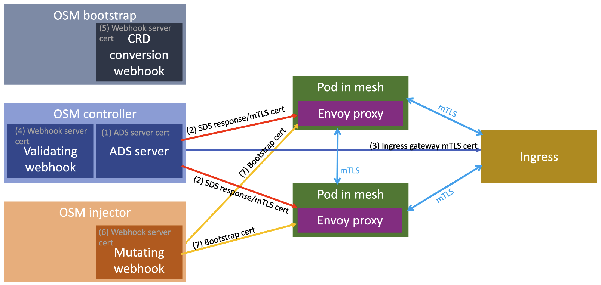

# Certificate management

Certificates play a large role in OSM and certificate management is a critical part of operations.

Currently there are three supported certificate managers:

- Built-in ([tresor](https://github.com/openservicemesh/osm/tree/main/pkg/certificate/providers/tresor))
- [cert-manager](https://cert-manager.io/)
- [HashiCorp Vault](https://www.hashicorp.com/products/vault)

All certificate managers implement the `Issuer` interface (located in `pkg/certificate`). Currently this interface is defined as:

```go
// Issuer is the interface declaring the methods for the Certificate Manager.
type Issuer interface {
	// IssueCertificate issues a new certificate.
	IssueCertificate(CommonName, time.Duration) (*Certificate, error)
}
```

## Certificate issuance and usage

Open Service Mesh will issue certificates during the following operations:

**ADS (Aggregated Discovery Service) server creation** *(Diagram object 1)* - When OSM controller starts up it will create an ADS server. `IssueCertificate` is called for the given certificate manager and that certificate is used to create the gRPC server for ADS so that Envoy proxies can securely communicate with it.

**SDS (Secret Discovery Service) response** *(Diagram object 2)* - When the ADS server is created it will pass an SDS handler. This SDS handler is used to create an SDS response to the proxies requesting secrets. Part of the secret response is the certificate.

**Ingress gateway certificate** *(Diagram object 3)* - A certificate will be issued to the ingress controller when ingress is initialized. A goroutine will be started to monitor for different changes (mesh config change and cert rotation). Certificate rotation will also make a call to `IssueCertificate`.

**Validating webhook** *(Diagram object 4)* - When OSM controller starts up it will create a validating webhook server. A certificate will be issued for this webhook server. This certificate is stored in the OSM control plane namespace and named `validating-webhook-cert-secret`.

**Conversion webhook** *(Diagram object 5)* - When OSM bootstrap starts it will create a web server for the CRD conversion webhook. A certificate will be issued for this web server. This certificate is stored in the OSM control plane namespace and named `crd-converter-cert-secret`.

**Mutating webhook** *(Diagram object 6)* - When OSM injector starts it will create a web server for the mutating webhook to inject the proxy into the pods joined to the mesh. This web server will have a certificate issued for it. This certificate is stored in the OSM control plane namespace and named `mutating-webhook-cert-secret`.

**Mutating webhook patch** *(Diagram object 7)* - Part of the mutating webhook implementation is to create a patch to inject the proxy sidecar. A bootstrap certificate will be issued so that the Envoy sidecar can communicate with the XDS server. The bootstrap config (including this certificate) will be stored in the same namespace as the pod as a secret with the name `envoy-bootstrap-config-<proxy_id>`.



## Certificate rotation

Each of the certificate managers will run a goroutine to that will check certificate expiration (currently this is hardcoded to every 5 seconds). This goroutine will loop through all certificates from the certificate manager and check to see if the certificates are within 30 seconds of expiration (with additional noise factored in). If so, the certificate will be rotated.

## Root certificate

The root certificate is stored by default in the OSM control plane namespace and named `osm-ca-bundle` when using the built-in certificate manager (tresor). The root certificate is what is used for the certificate manager to issue certificates. For example, the metadata for the root certificate in an installation:

*Note: This document assumes that OSM is installed in the namespace `osm-system`, but in the event that is not the case then please substitute `osm-system` with the correct namespace.*

```
$ kubectl get secret -n osm-system osm-ca-bundle -o jsonpath='{.data.ca\.crt}' | base64 -d | openssl x509 -noout -text
Certificate:
    Data:
        Version: 3 (0x2)
        Serial Number:
            72:2a:87:e6:b8:42:0d:71:ab:fc:f7:d9:e5:87:19:72
        Signature Algorithm: sha256WithRSAEncryption
        Issuer: C = US, L = CA, O = Open Service Mesh, CN = osm-ca.openservicemesh.io
        Validity
            Not Before: Jan 20 14:46:24 2022 GMT
            Not After : Jan 18 14:46:24 2032 GMT
        Subject: C = US, L = CA, O = Open Service Mesh, CN = osm-ca.openservicemesh.io
        Subject Public Key Info:
            Public Key Algorithm: rsaEncryption
                RSA Public-Key: (2048 bit)
... output removed for brevity ...
```

Compare that to the CA cert in an issued certificate (for example, a bootstrap cert for a proxy):

```
$ kubectl get secret -n bookstore envoy-bootstrap-config-6048e496-40d9-4b49-b450-3772c5627581 -o jsonpath='{.data.bootstrap\.yaml}' |
    base64 -d |
    yq ".static_resources.clusters[0].transport_socket.typed_config.common_tls_context.validation_context.trusted_ca.inline_bytes" -r |
    base64 -d | openssl x509 -noout -text
Certificate:
    Data:
        Version: 3 (0x2)
        Serial Number:
            72:2a:87:e6:b8:42:0d:71:ab:fc:f7:d9:e5:87:19:72
        Signature Algorithm: sha256WithRSAEncryption
        Issuer: C = US, L = CA, O = Open Service Mesh, CN = osm-ca.openservicemesh.io
        Validity
            Not Before: Jan 20 14:46:24 2022 GMT
            Not After : Jan 18 14:46:24 2032 GMT
        Subject: C = US, L = CA, O = Open Service Mesh, CN = osm-ca.openservicemesh.io
```

You can also see that these are the same by comparing the modulus of the certificates:

```
$ kubectl get secret -n osm-system osm-ca-bundle -o jsonpath='{.data.ca\.crt}' |
        base64 -d | openssl x509 -noout -modulus &&
    kubectl get secret -n bookstore envoy-bootstrap-config-6048e496-40d9-4b49-b450-3772c5627581 -o jsonpath='{.data.bootstrap\.yaml}' |
        base64 -d | yq ".static_resources.clusters[0].transport_socket.typed_config.common_tls_context.validation_context.trusted_ca.inline_bytes" -r |
        base64 -d | openssl x509 -noout -modulus
Modulus=A8E69...545E9
Modulus=A8E69...545E9
```

## cert-manager

When using cert-manager as the certificate manager for Open Service Mesh, it will leverage the root certificate that is specified in the OSM controller on startup with the following parameters:

- **--certificate-manager** - Certificate manager type (for cert-manager, use `cert-manager`)
- **--cert-manager-issuer-kind** - The API resource kind for the issuer (defaults to and likely `Issuer`)
- **--cert-manager-issuer-group** - Kubernetes API group for the issuer (defaults to and likely `cert-manager.io`)
- **--cert-manager-issuer-name** - The cert-manager `Issuer` for the root certificate (likely `osm-ca`. You can see the secret that backs the certificate for the issuer with `kubectl get issuer -n osm-system osm-ca -o jsonpath='{.spec.ca.secretName}'`)
- **--ca-bundle-secret-name** - Kubernetes secret that is the storage backing for the cert-manager `Certificate` (likely `osm-ca-bundle` but can be retrieved with `kubectl get cert -n osm-system osm-ca -o jsonpath='{.spec.secretName}'`)

To get the certificate issued from cert-manager, OSM controller will create a certificate request from `crypto/x509`:

```go
x509.CertificateRequest{
	Version:            3,
	SignatureAlgorithm: x509.SHA512WithRSA,
	PublicKeyAlgorithm: x509.RSA,
	Subject: pkix.Name{
		CommonName: cn.String(),
	},
	DNSNames: []string{cn.String()},
}
```

It will then encode this certificate signing request (CSR) in PEM format and create a cert-manager CSR:

```go
cmapi.CertificateRequest{
	ObjectMeta: metav1.ObjectMeta{
		GenerateName: "osm-",
		Namespace:    cm.namespace,
	},
	Spec: cmapi.CertificateRequestSpec{
		Duration: duration,
		IsCA:     false,
		Usages: []cmapi.KeyUsage{
			cmapi.UsageKeyEncipherment, cmapi.UsageDigitalSignature,
		},
		Request:   csrPEM,
		IssuerRef: cm.issuerRef,
	},
}
```

The certificate will be retrieved by making a request directly to cert-manager by `(*CertManager).certificateFromCertificateRequest`. Here is an example issuer for OSM:

```
$ kubectl get issuer -n osm-system osm-ca -o yaml
metadata:
  annotations:
    kubectl.kubernetes.io/last-applied-configuration: |
      {"apiVersion":"cert-manager.io/v1","kind":"Issuer","metadata":{"annotations":{},"name":"osm-ca","namespace":"osm-system"},"spec":{"ca":{"secretName":"osm-ca-bundle"}}}
  name: osm-ca
  namespace: osm-system
spec:
  ca:
    secretName: osm-ca-bundle
```

In this case the CA root cert is defined as having its own issuer which is a self-signed certificate:

```
$ kubectl get cert -n osm-system osm-ca -o yaml
apiVersion: cert-manager.io/v1
kind: Certificate
metadata:
  annotations:
    kubectl.kubernetes.io/last-applied-configuration: |
      {"apiVersion":"cert-manager.io/v1","kind":"Certificate","metadata":{"annotations":{},"name":"osm-ca","namespace":"osm-system"},"spec":{"commonName":"osm-system","duration":"2160h","isCA":true,"issuerRef":{"group":"cert-manager.io","kind":"Issuer","name":"selfsigned"},"secretName":"osm-ca-bundle"}}
  name: osm-ca
  namespace: osm-system
spec:
  commonName: osm-system
  duration: 2160h0m0s
  isCA: true
  issuerRef:
    group: cert-manager.io
    kind: Issuer
    name: selfsigned
  secretName: osm-ca-bundle
```

The certificate is set as a CA cert (you can see this in the certificate metadata) and the backing secret name is set to `osm-ca-bundle`. You can inspect the CA bundle:

```
$ kubectl get secret -n osm-system osm-ca-bundle -o yaml
apiVersion: v1
kind: Secret
metadata:
  annotations:
    cert-manager.io/alt-names: ""
    cert-manager.io/certificate-name: osm-ca
    cert-manager.io/common-name: osm-system
    cert-manager.io/ip-sans: ""
    cert-manager.io/issuer-group: cert-manager.io
    cert-manager.io/issuer-kind: Issuer
    cert-manager.io/issuer-name: selfsigned
    cert-manager.io/uri-sans: ""
    manager: controller
    operation: Update
  name: osm-ca-bundle
  namespace: osm-system
data:
  ca.crt: LS0tLS1CRUdJTiBDRVJUSUZJQ...
  tls.crt: LS0tLS1CRUdJTiBDRVJUSUZJ...
  tls.key: LS0tLS1CRUdJTiBSU0EgUFJJ...
```

## HashiCorp Vault

When utilizing Vault as the certificate manager, OSM will make a call to Vault's API through `Logical.Write` to issue certificates. The returned certificate will be sent to the caller. To get the issuing CA from Vault, OSM will create a temporary certificate with `localhost` as the CommonName (CN). This temporary certificate will be immediately released.

Notable options when using Vault:

- **osm.certificateProvider.kind** - Certificate manager type (for vault, use `vault`)
- **osm.vault.host** - Hashicorp Vault host/service - where Vault is installed (defaults to "")
- **osm.vault.protocol** - The protocol to use to connect to Vault (defaults to "http")
- **osm.vault.token** - The token that should be used to connect to Vault (defaults to "")
- **osm.vault.role** - The vault role to be used by Open Service Mesh (defaults to "openservicemesh")
