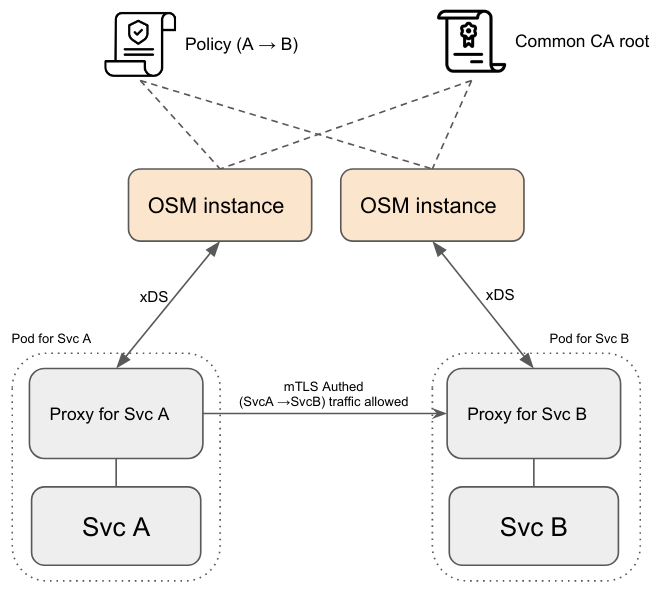
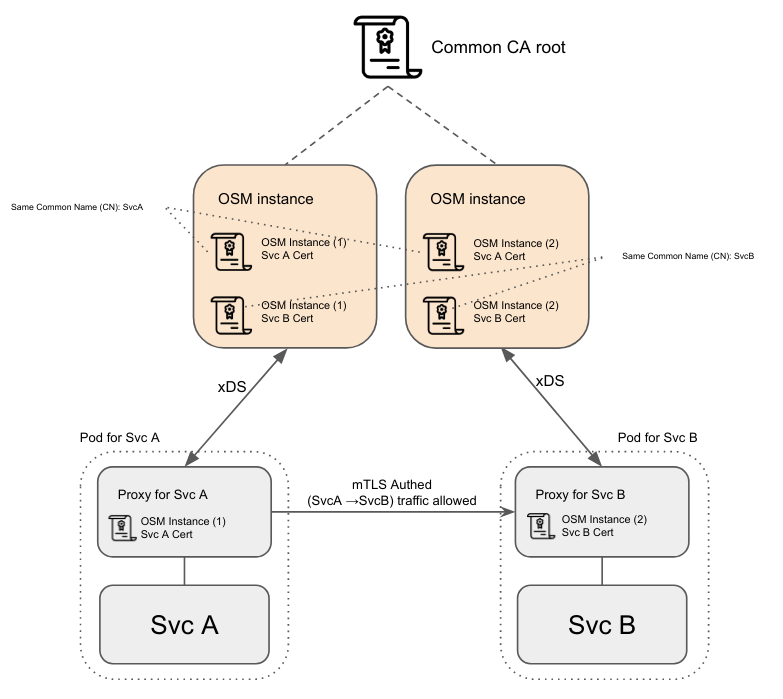
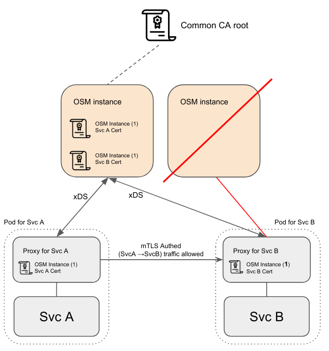

# HA Design considerations

OSM's control plane components are built with High Availability and Fault Tolerance in mind. The following sections will thoroughly document how are these tackled.

## High Availability and Fault Tolerance

High Availability and Fault Tolerance are implemented and ensured by several design decisions and external mechanisms in OSM, which will be documented in the following points:

### Statelessness
OSM's control plane components do not own or have any state-dependent data that needs to be saved at runtime; with the controlled exceptions of:
- CA / Root Certificate: The CA root certificate is required to be the same for multiple OSM instances when running multiple replica. For [Certificate Managers](/DESIGN.md#2-certificate-manager) implementations that require the root CA to have been generated/provided prior OSM execution (Vault, Cert-Manager), the root CA will be fetched from the provider at boot by all instances.
For other Certificate Providers that can autogenerate a CA when none is present (such as Tresor), atomicity and synchronization will be ensured during creation, ensuring all instances load the same CA.
- Envoy Bootstrap Certificates (used by the proxies to authenticate against the control plane): these are created during injection webhook handling and inlined as part of the Proxy's bootstrap configuration. The configuration is stored as a kubernetes secret and mounted in the injected envoy pod as a volume, assuring idempotence for a single pod at any one time.

Other than those exceptions, the rest of the configuration is built and fetched from Kubernetes.

The domain state used to compute the traffic policies is entirely provided by the different runtime providers (Kubernetes _et al_) and Kubernetes client-go informers on the related objects `osm-controller` subscribes to.

Multiple `osm-controller`s running will subscribe to the same set of objects and will generate the identical configurations for the service mesh. Due to the nature of client-go Kubernetes informers being eventually consistent `osm-controller` guarantees policy enforcement to be eventually consistent.

  

### Restartability: 
The previous stateless design considerations should ensure OSM's control plane components are fully restartable.

- A restarting instance will resynchronize all Kubernetes domain resources. Existing proxies will reconnect, and (assuming no changes occurred on the mesh topology or policy) the same configuration should be recomputed and pushed as a new version to the proxies.

### Horizontal scaling
Components `osm-controller` and `osm-injector` allow for separate horizontal scaling, depending on load or availability requirements.
- When an `osm-controller` is spawned with multiple replicas, connecting proxies may be load-balanced and connected to any of the existing OSM instances running for the control plane.
- Similarly, `osm-injector` can be horizontally scaled to handle an increased number/rate of pod onboardings on the mesh.
- In `osm-controller`, Service certificates (used between proxies to TLS authenticate and communicate with each other) are short lived and kept only in runtime on control plane (though pushed as part of proxy xDS protocol when required).

  Multiple `osm-controller` instances might create different yet valid service certificates for a single service. These different certificates will (1) have been signed by the same root, as multiple OSM instances must load the same root CA, and (2) will have the same Common Name (CN), which is be used to match against and authenticate when traffic is proxied between services.

  

  In short, no matter what control plane a proxy connects to, a valid certificate, with correct/proper CN and signed by the shared control plane root CA, will be pushed to it.

- Increasing horizontal scale will NOT redistribute established proxy connections to the control plane unless they are disconnected.
- Decreasing horizontal scale will make the disconnected proxies connect to instances that were not terminated by the downscale. New versions of the config should be computed and pushed upon establishing the connection anew.

  

- If the control plane is brought down entirely, running proxies should continue to operate in headless[1] mode till they can reconnect to a running control plane.

[1] Headless: usually referred in the control-plane/data-plane design paradigm, refers to the concept that allows, when having a dependency between two components, for the depender agent to survive and keep running with latest state when the dependee dies or becomes unreachable.
