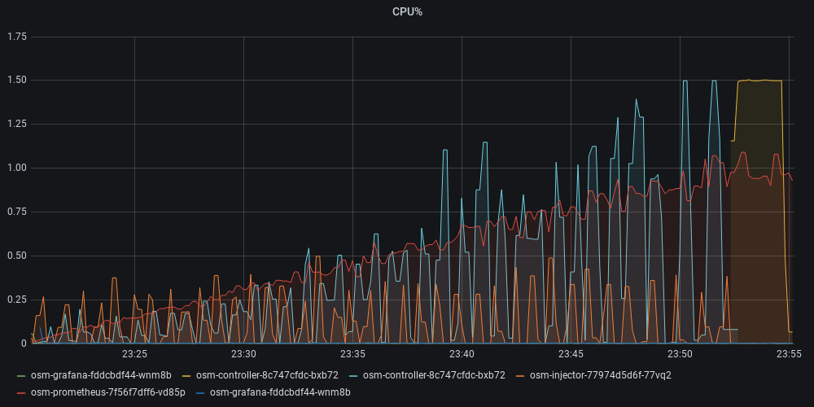
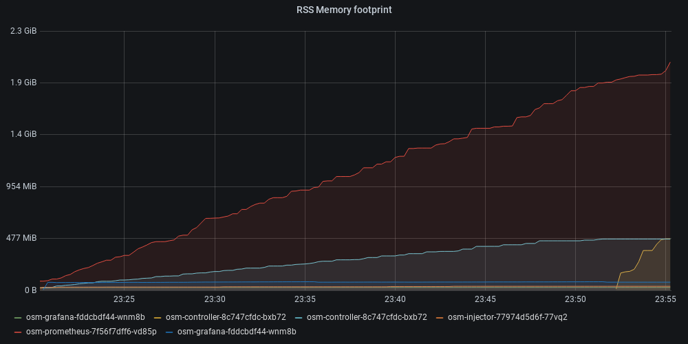

--- 
 title: "Scale and limits" 
 description: "Documentation regarding OSM's current scale and limitations" 
 type: docs 
--- 
# Scale and limits

This document describes current scale and limits known in OSM as of 02/04/2021.

## Considerations
The scale limits documented here have to be put in light of current architecture. 
Current architecture relies on a global broadcast mechanism that does not account for proxy configuration deltas, therefore all proxy configurations are computed and pushed upon any change.

## Testing and measures
We currently hold a single test which attempts to scale infinitely a topology subset, test proper traffic configuration between the new pods/services being deployed in the iteration, and stop if any failure is seen.
It is also acknowledged that some of the scale constraints need to be addressed before it even makes sense to proceed with any additional scale testing, hence the lack of additional test scenarios.

## Test
The test was run in different OSM form factors, factoring in different amounts of RAM/CPU, to better qualify potential limits in case any of those were to be a constraint upon deployment.

#### For all tests:
- Using Release v0.8 (Tue Mar 23)
- 8 Node (Kubernetes v1.20, nodes: 4vcpu 16Gb)
- Envoy proxy log level Error
- 2048 bitsize RSA keys 
- OSM controller
  - Log level Error
  - Using default max 1.5 CPU
  - Using default 512MB Memory
- OSM Injector
  - Log level Error
  - Using default max 0.5 CPU
  - Using default max 64MB Memory
- HTTP debug server disabled on OSM
- Test topology deploys each iteration:
	- 2 clients
		- 5 replicaset per client
	- 5 server services
		- 2 replicaset per server service
	- 1 TrafficSplit between the 5 server services (10 pods backed)
	- Total of 20 pods each iteration. 10 client pods will REST GET the Traffic split.
	- Correctness is ensured. It is checked that all TrafficSplit server members are eventually reached.
- Test timeout for network correctness: 150 seconds

## Assessment and Limits
*Note: Assuming proxy per pod, so pod/proxies can be used interchangeably.*
### CPU
#### OSM Controller
- **1vcpu per 500 proxies**, however giving more cpu does not scale linearly (m<1) with current architecture; horizontal scaling should be considered to increase supported mesh size. 
- Network settlment times vary from **<10s with no pods to +2min at 700 pods**. 

  

<i>In blue, OSM controller, orange for OSM Injector, red for Prometheus</i>
 

#### OSM Injector
- Injector shows constant handling of 20 pods at a time, with constant times to create the 2048bit certificates and webhook handling staying around the 2-5sec (accounting for the certificate creation).

#### Prometheus
- Prometheus shows an increase of CPU per scrapped pod to almost **1vcpu per 700 pods**.
This has to take into account our default settings and our scrapping options (which, for example, we use quite low `scrape_interval`), which heavily affect the resources consumed.

### Memory
#### OSM Controller
Memory per pod/envoy onboarded in the network is calculated after the initial snapshot with nothing onboarded on the mesh is seen to take into account standalone memory used by OSM.
- Memory (RSS) in controller: **650kB-1MB per proxy**

  

<i>In light blue, OSM controller; red for Prometheus</i>
 

#### OSM Injector
OSM injector doesn't store any intermediate state per pod, so it has no immediate scalability constraint at this scale order of magnitude.

#### Prometheus
*NOTE: This assumes our defaults and metrics of interest used, and can heavily vary based on deployment needs.*

- Prometheus shows a memory increase per proxy of about **~2.6MB per proxy**
