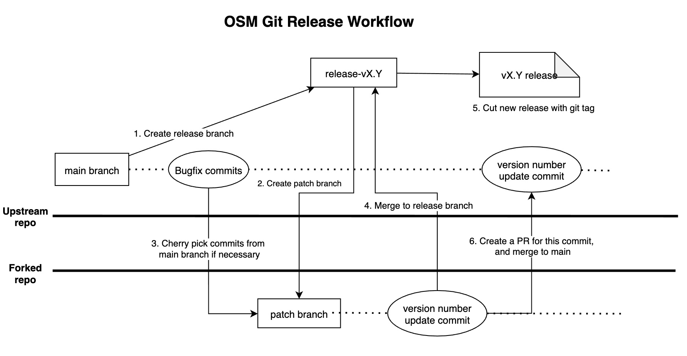

# Release Guide

This guide describes the process to create a GitHub Release for this project.

**Note**: These steps assume that all OSM components are being released together, including the CLI, container images, and Helm chart, all with the same version.

## Release Candidates

Release candidates (RCs) should be created before each significant release so final testing can be performed. RCs are tagged as `vX.Y.Z-rc.W`. After the following steps have been performed to publish the RC, perform any final testing with the published release artifacts for about one week.

If issues are found, submit patches to the RC's release branch and create a new RC with the tag `vX.Y.Z-rc.W+1`. Apply those same patches to the `main` branch. Repeat until the release is suitably stable.

Once an RC has been found to be stable, cut a release tagged `vX.Y.Z` using the following steps.

- [Release Guide](#release-guide)
  - [Release Candidates](#release-candidates)
  - [Create a release branch](#create-a-release-branch)
  - [Create and push the pre-release Git tag](#create-and-push-the-pre-release-git-tag)
  - [Update release branch with patches and versioning changes](#update-release-branch-with-patches-and-versioning-changes)
  - [Create and push the release Git tag](#create-and-push-the-release-git-tag)
  - [Add release notes](#add-release-notes)
  - [Update documentation and docs.openservicemesh.io website](#update-documentation-and-docsopenservicemeshio-website)
    - [1. Create the release specific branch in osm-docs repo](#1-create-the-release-specific-branch-in-osm-docs-repo)
    - [2. Update version references to the latest version for the given Major.Minor version](#2-update-version-references-to-the-latest-version-for-the-given-majorminor-version)
    - [3. Update API reference documentation](#3-update-api-reference-documentation)
    - [4. Update error code documentation](#4-update-error-code-documentation)
  - [Announce the new release](#announce-the-new-release)
  - [Make version changes on main branch](#make-version-changes-on-main-branch)
  - [Workflow Diagram](#workflow-diagram)

## Create a release branch

Look for a branch on the upstream repo named `release-vX.Y`, where `X` and `Y` correspond to the major and minor version of the semver tag to be used for the new release. If the branch already exists, skip to the next step.

Identify the base commit in the `main` branch for the release and cut a release branch off `main`.
```console
$ git checkout -b release-<version> <commit-id> # ex: git checkout -b release-v0.4 0d05587
```
> Note: Care must be taken to ensure the release branch is created from a commit meant for the release. If unsure about the commit to use to create the release branch, please open an issue in the `osm` repo and a maintainer will assist you with this.

Push the release branch to the upstream repo (NOT forked), identified here by the `upstream` remote.
```console
$ git push upstream release-<version> # ex: git push upstream release-v0.4
```

## Create and push the pre-release Git tag

The pre-release Git tag publishes the OSM control plane images to the Openservicemesh container registry in Dockerhub, and publishes the image digests as an artifact of the pre-release Github workflow. The image digests must be used in the next step to update the default control plane image referenced in the Helm charts.

The pre-release Git tag is of the form `pre-rel-<release-version>`, e.g. `pre-rel-v0.4.0`.

```console
$ PRE_RELEASE_VERSION=<pre-release-version> # ex: PRE_RELEASE_VERSION=pre-rel-v0.4.0
$ git tag "$PRE_RELEASE_VERSION"
$ git push upstream "$PRE_RELEASE_VERSION"
```

Once the pre-release Git tag has been pushed, wait for the Pre-release Github workflow to complete. Upon workflow completion, retrieve the image digests for the given release. The image digests are uploaded as a part of the Pre-release workflow. Note that multiple image digest files will be present in the uploaded artifact, one per image tag, e.g. v0.4.0 and latest. Use the release version specific image digest file to extract the image digests to be used as the default for the control plane images, i.e. osm_image_digest_v0.4.0.txt instead of osm_image_digest_latest.txt if the release version if v0.4.0.

The image digest file contains the sha256 image digest for each control plane image as follows:
```console
openservicemesh/init   v0.4.0    sha256:a9f3b6b53132266d9090d1fe9e1cbbcf9caa5ca6b8ed247797ce7af6df22bf0e   67349d2e350f   4 seconds ago   7.77MB
openservicemesh/osm-controller           v0.4.0                                   sha256:eb194138abddbe271d42b290489917168a6a891a3dabb575de02c53f13879bee   e61b990a7926   6 seconds ago   54.1MB
openservicemesh/osm-injector             v0.4.0                                   sha256:311d87892778d976baf2560622a258ac011a5a3f755d05566ce17458d04fdda1   2ff0e76bccdc   6 seconds ago    52.1MB
openservicemesh/osm-crds                 v0.4.0                                   sha256:542d6dd31d9ceae8f0d4bc4020d6df19791c7207e8a76047193968bb51799d7e   1c7eb6b2a25c   2 seconds ago    133MB
openservicemesh/osm-bootstrap            v0.4.0                                   sha256:9aad07e55e7d1e650b9398f1487695ac016a1b74d60a9879ddcf6455f84cd8f0   f40ca40df626   6 seconds ago    51MB
```

## Update release branch with patches and versioning changes

Create a new branch off of the release branch to maintain updates specific to the new version. Let's call it the patch branch. The patch branch should not be created in the upstream repo.

If there are other commits on the `main` branch to be included in the release (such as for successive release candidates or patch releases), cherry-pick those onto the patch branch.

Create a new commit on the patch branch to update the hardcoded version information in the following locations:

* The control plane image digests  defined by `osm.image.digest` for images in [charts/osm/values.yaml](/charts/osm/values.yaml) from the image digests obtained from the Pre-release workflow. For example, if the osm-controller image digest is `sha256:eb194138abddbe271d42b290489917168a6a891a3dabb575de02c53f13879bee`, update the value of `osm.image.digest.osmController` to `sha256:eb194138abddbe271d42b290489917168a6a891a3dabb575de02c53f13879bee`.
* Replace the `latest-main` tag with the release version tag for all images throughout the repo, e.g. `v0.4.0`. This includes updating the image references in `charts/osm` and `docs/example/manifests` folders.
* The chart and app version in [charts/osm/Chart.yaml](/charts/osm/Chart.yaml) to the release version.
* The Helm chart [README.md](/charts/osm/README.md)
  - Necessary changes should be made automatically by running `make chart-readme`

Once patches and version information have been updated on the patch branch off of the release branch, create a pull request from the patch branch to the release branch. When creating your pull request, generate the release checklist for the description by adding the following to the PR URL: `?expand=1&template=release_pull_request_template.md`. Alternatively, copy the raw template from [release_pull_request_template.md](/.github/PULL_REQUEST_TEMPLATE/release_pull_request_template.md).

Proceed to the next step once the pull request is approved and merged.

## Create and push the release Git tag

Ensure your local copy of the release branch has the latest changes from the PR merged above.

Once the release is ready to be published, create and push a Git tag from the release branch to
the main repo (not fork), identified here by the `upstream` remote.

```console
$ export RELEASE_VERSION=<release-version> # ex: export RELEASE_VERSION=v0.4.0
$ git tag "$RELEASE_VERSION"
$ git push upstream "$RELEASE_VERSION"
```

A [GitHub Action](/.github/workflows/release.yml) is triggered when the tag is pushed.
It will build the CLI binaries, publish a new GitHub release,
upload the packaged binaries and checksums as release assets, build and push Docker images for OSM and the demo to the
[`openservicemesh` organization](https://hub.docker.com/u/openservicemesh) on Docker Hub, and publish the Helm chart to the repo hosted at https://openservicemesh.github.io/osm.

## Add release notes

The release job runs the `scripts/release-notes.sh` script to generate release notes for the specific release tag. Update the `Notable Changes` and `Deprecation Notes` section based on notable feature additions, critical bug fixes, and deprecated functionality.

## Update documentation and docs.openservicemesh.io website

### 1. Create the release specific branch in osm-docs repo

If a branch corresponding to the Major.Minor version is not available in the [osm-docs](https://github.com/openservicemesh/osm-docs) repo, create it based on https://github.com/openservicemesh/osm-docs/blob/main/README.md#adding-release-specific-docs. For example, to publish the documentation for v0.10.0, there must exist a release-v0.10 branch in the `osm-docs` repo.

*Note:
1. Do not create a branch for patch releases. The same documentation is used for patches having the same Major.Minor version.
1. Care must be taken to ensure the release branch is created from a commit that meant for the release. If unsure about the commit to use to create the release branch, please open an issue in the `osm-docs` repo and a maintainer will assist you with this.

### 2. Update version references to the latest version for the given Major.Minor version

For example, when v0.10.1 is being released, update all of the version references from v0.10.0 to v0.10.1 to reflect the latest documentation for the Major.Minor version. Instructions for updating the release version references can be found at [https://github.com/openservicemesh/osm-docs/blob/main/README.md/#update-the-release-references](https://github.com/openservicemesh/osm-docs/blob/main/README.md/#update-the-release-references).

### 3. Update API reference documentation

Follow the [Generating API Reference Documentation](/docs/api_reference/README.md) guide to update the API references on the docs site.

### 4. Update error code documentation

On the docs site's main branch, edit the file [https://github.com/openservicemesh/osm-docs/blob/main/content/docs/guides/troubleshooting/control_plane_error_codes.md](https://github.com/openservicemesh/osm-docs/blob/main/content/docs/guides/troubleshooting/control_plane_error_codes.md) to update the OSM error code table.

1. Build OSM on the release branch.
1. Generate the mapping of OSM error codes and their descriptions using the `osm support` cli tool.

   ```
   ./bin/osm support error-info

    +------------+----------------------------------------------------------------------------------+
    | ERROR CODE |                                   DESCRIPTION                                    |
    +------------+----------------------------------------------------------------------------------+
    | E1000      | An invalid command line argument was passed to the application.                  |
    +------------+----------------------------------------------------------------------------------+
    | E1001      | The specified log level could not be set in the system.                          |
   ```

1. Copy the table and replace the existing table in the file [https://github.com/openservicemesh/osm-docs/blob/main/content/docs/guides/troubleshooting/control_plane_error_codes.md](https://github.com/openservicemesh/osm-docs/blob/main/content/docs/guides/troubleshooting/control_plane_error_codes.md).
1. If there were updates to the table, make a PR in the OSM docs repository.


## Announce the new release

Make an announcement on the [OSM mailing list](https://groups.google.com/g/openservicemesh) and [OSM Slack channel](https://cloud-native.slack.com/archives/openservicemesh) after you [join CNCF Slack](https://slack.cncf.io/).

## Make version changes on main branch

Skip this step if the release is a release candidate (RC).

Open a pull request against the `main` branch to update the `version` field in `charts/osm/Chart.yaml` to the release version.

## Workflow Diagram

Here is a diagram to illustrate the git branching strategy and workflow in the release process:


